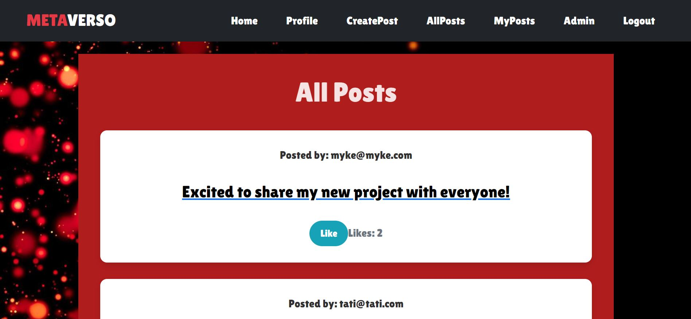

# SocialNetwork Frontend🥤

Welcome to my SocialNetwork Frontend project, I hope you like it!💯
<br><br>

</a>

<details>
  <summary>Table of Contents📝</summary>
  <ol>
 <li><a href="#description">Description</a></li>
    <li><a href="#objetive">Objetive</a></li>
    <li><a href="#stack">Stack</a></li>
    <li><a href="#local-installation">Local installation</a></li>
    <li><a href="#views">Views</a></li>
    <li><a href="#future-functionalities️">Future functionalities</a></li>
    <li><a href="#development">Development</a></li>
    <li><a href="#appreciations">Appreciations</a></li>
    <li><a href="#contact">Contact</a></li>
  </ol>
</details>
<br>

## Description📚
This project consists of the creation of the front end for "Metaverse", a social network that connects to our API in charge of managing the platform's business model. To do this, we will develop views that will allow users to register, log in, view and modify their profile, as well as interact with other users through posts. In addition, users will be able to explore the content of the social network and discover popular trends.

The project will also include an administrator view from which you can manage application information, monitor user activity, and moderate content published on the platform, ensuring a safe and attractive environment for everyone.
<br><br>
<p align="center">

</p>

## Objetive🎯
The objetive of this project is to create a front end of the app versatile enough for clients, professionals and an administrator to access and make use of it, for this I have been using React until I get a good command of the language.

## Stack📒
Used technology:
<div align="center">
<a>
    
</a>
<a>
    
</a>
<a>
    
</a>
<a>
    
</a>
<a>

</a>
<a>
    
</a>
<a>
    
</a>
<a>
    
</a>
<a>
    
</a>
<a>
    
</a>
<a>
    
</a>
<a>
    
</a>
</div>

## Local installation🧾

### Frontend📊

1. Clone the repository
2. ``` $ npm install  ```
3. ``` $ npm run dev ```

### Backend⚙️

1. Install docker and create a mongo container
2. Clone the repository
3. ``` $ npm install  ```
4. ``` $ npm db:seed ```
5. ``` $ npm run dev ```


## Views🧩

### Home🏠


### Login and Register🔑


### Profile👥


### Admin Dashboard💯


### Create Posts✏️


### My Posts📓


### All Posts🔍



### Post Detail👀


## Future functionalities⏭️
- Option to follow.
- Leave comments on posts.
- Data validation.
- ...


## Development👨🏻‍💻

```js
const developer = "DavidFernandez";

console.log("Developed by: " DavidFernandez);
```

## Appreciations💯

I would like to dedicate my thanks to the teachers at Geeks Hubs as well as my day to day peers with whom we can help each other with our problems.


## Contact📲
- **David Fernandez Valle**
  - [GitHub](https://github.com/Davfernandezz)
  - [Linkedin](https://www.linkedin.com/in/david-fern%C3%A1ndez-valle-1b4461300/?originalSubdomain=es)
